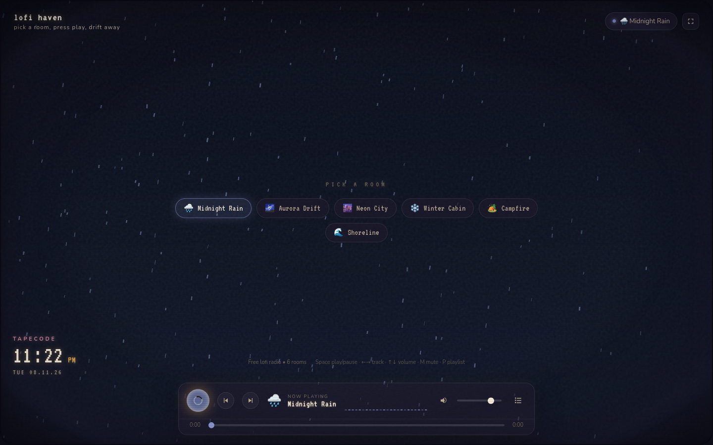
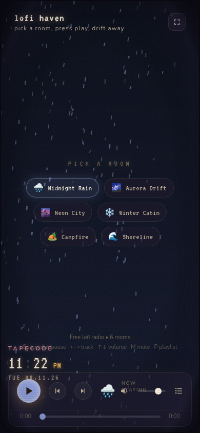

# lofi haven

Cozy lofi.cafe-style ambient music radio. Pick a room, press play, and drift away.

## Live site

**https://makunno.github.io/lofi-haven/**

## Screenshots

Desktop:

Mobile:

## About

Six themed rooms, each with its own animated canvas scene and curated YouTube playlist:

- 🌧️ **Midnight Rain** — droplets on the window, city asleep, coffee still warm
- 🌌 **Aurora Drift** — dark aurora skies and drifting northern lights
- 🌆 **Neon City** — late-night streets, neon signs, a city that never sleeps
- ❄️ **Winter Cabin** — snowfall outside, a fire inside, nowhere to be
- 🏕️ **Campfire** — stories around a crackling fire under open stars
- 🌊 **Shoreline** — waves rolling in, chilled beats on a golden horizon

The scene takes center stage: stations are small chips, controls live in a bottom dock, and a subtle CRT overlay keeps things cozy. A floating TAPECODE desk clock, custom cursor, and live visualizer round out the ambiance.

## Keyboard shortcuts

| Key | Action |
| --- | --- |
| `Space` | Play / pause |
| `←` / `→` | Previous / next track |
| `↑` / `↓` | Volume up / down |
| `M` | Mute |
| `P` | Toggle playlist panel |

## Tech stack

- React + TypeScript + Vite
- Canvas-based background effects and audio visualizer
- YouTube IFrame Player API for playlist playback
